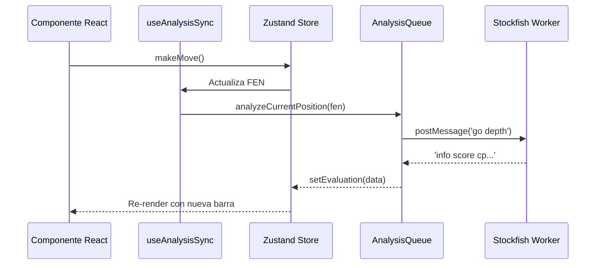

# ♟️ Arquitectura del Proyecto: Tablero de Análisis

Este documento detalla las decisiones técnicas, la estructura del estado y el flujo de datos del Tablero de Análisis de Ajedrez.

## 1. Visión General
La aplicación es una herramienta de análisis de ajedrez de alto rendimiento basada en la web. Permite importar partidas de plataformas como Lichess y Chess.com, y realizar análisis en tiempo real utilizando Stockfish 18 (versión Lite).

## 2. Tecnologías Principales
- **React 19**: Framework de UI.
- **Zustand 5**: Gestión de estado global con patrón de slices y persistencia parcial.
- **Stockfish 18 WASM**: Motor de ajedrez ejecutado en un Web Worker.
- **Chess.js v1.4**: Motor de lógica de ajedrez (validación, PGN, FEN).
- **React-Chessboard**: Componente de interfaz de tablero.
- **Framer Motion**: Orquestación de animaciones.

## 3. Arquitectura del Estado (Zustand)
El estado se divide en tres slices principales que se fusionan en un único store:

### Slices
- **GameSlice**: Gestiona el historial de la partida, la posición actual (FEN), las cabeceras y la lógica de movimientos.
- **AnalysisSlice**: Almacena los resultados del motor (evaluaciones, mejores jugadas, líneas alternativas) y la configuración de Stockfish.
- **UISlice**: Controla elementos visuales, modales, relojes y configuraciones de visualización.

> [!WARNING]
> **Deuda Técnica de Redundancia:** Actualmente existe un solapamiento de propiedades entre `GameSlice` y `AnalysisSlice`. Se requiere una refactorización para consolidar toda la lógica de evaluación exclusivamente en `AnalysisSlice`.

## 4. Flujo de Sincronización y Motor
El flujo de datos sigue un modelo de "Controlador por Hook":

1.  **useAnalysisSync**: Este hook escucha cambios en el `fen` y `gameId`.
2.  **AnalysisQueue**: Servicio que actúa como mutex para Stockfish. Asegura que el motor no sea saturado con múltiples peticiones concurrentes y gestiona la prioridad del análisis (primero la posición actual, luego el resto de la partida).
3.  **StockfishService**: Encapsula el Web Worker. Gestiona la inicialización de la memoria (Hash) y los hilos (Threads).

## 5. Reglas de Evaluación y Precisión
El motor de evaluación (`evaluationRules.js`) utiliza una fórmula de probabilidad de victoria (Win Probability) para clasificar las jugadas:
- **Brillante**: Jugada que mejora significativamente la probabilidad de victoria según el motor.
- **Libro**: Jugadas identificadas en la base de datos de teoría de Lichess.
- **Precisión (Accuracy)**: Calculada mediante una media armónica ponderada de la pérdida de probabilidad de victoria (WP Loss) en cada movimiento, excluyendo la fase de apertura.

## 6. Optimizaciones de Rendimiento
- **Smart Priority Order**: Durante el análisis de una partida completa, el sistema analiza primero el movimiento donde se encuentra el usuario, permitiendo retroalimentación instantánea.
- **NDJSON Parsing**: Las partidas de Lichess se procesan línea por línea para minimizar el uso de memoria en importaciones masivas.
- **Worker Recycling**: El worker se destruye y recrea solo cuando es estrictamente necesario para liberar recursos de memoria del navegador.

## 7. Consideraciones de Seguridad (PWA/Isolation)
Para que Stockfish funcione con multihilo y alto rendimiento, la aplicación requiere `Cross-Origin Isolation`. Esto se logra mediante cabeceras HTTP configuradas en `vite.config.js` y `netlify.toml`:
- `Cross-Origin-Embedder-Policy: require-corp`
- `Cross-Origin-Opener-Policy: same-origin`
