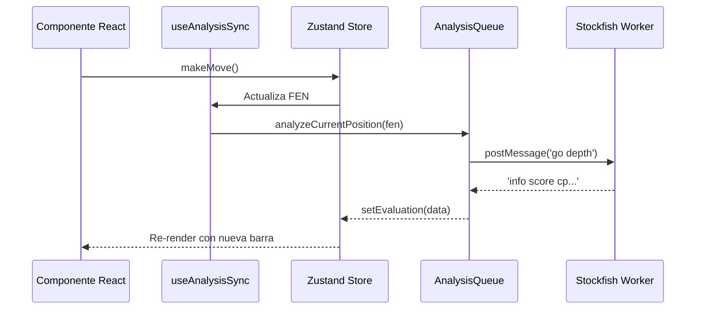

# ♟️ Arquitectura del Proyecto: Tablero de Análisis

Este documento detalla las decisiones técnicas, la estructura del estado y el flujo de datos del Tablero de Análisis de Ajedrez.

## 1. Visión General
La aplicación es una herramienta de análisis de ajedrez de alto rendimiento basada en la web. Permite importar partidas de plataformas como Lichess y Chess.com, y realizar análisis en tiempo real utilizando Stockfish 18 (versión Lite).

## 2. Tecnologías Principales
- **React 19**: Framework de UI con Fiber Architecture.
- **Zustand 5**: Gestión de estado global con patrón de slices y persistencia parcial.
- **Stockfish 18 WASM**: Motor de ajedrez ejecutado en un Web Worker con soporte SIMD y multihilo.
- **Chess.js v1.4**: Motor de lógica de ajedrez (validación, PGN, FEN).
- **React-Chessboard**: Componente de interfaz de tablero reactivo.
- **Framer Motion**: Orquestación de animaciones y micro-interacciones.

## 3. Arquitectura del Estado (Zustand)
El estado se divide en tres slices principales que se fusionan en un único store:

### Slices
- **GameSlice**: Gestiona el historial de la partida, la posición actual (FEN), las cabeceras y la lógica de movimientos.
- **AnalysisSlice**: Almacena los resultados del motor (evaluaciones, mejores jugadas, líneas alternativas) y la configuración de Stockfish.
- **UISlice**: Controla elementos visuales, modales, relojes y configuraciones de visualización.

## 4. Flujo de Sincronización y Motor
El flujo de datos sigue un modelo de "Controlador por Hook":

1.  **useAnalysisSync**: Este hook escucha cambios en el `fen` y `gameId`.
2.  **AnalysisQueue**: Servicio que actúa como mutex para Stockfish. Asegura que el motor no sea saturado con múltiples peticiones concurrentes y gestiona la prioridad del análisis (primero la posición actual, luego el resto de la partida).
3.  **StockfishService**: Encapsula el Web Worker. Gestiona la inicialización de la memoria (Hash) y los hilos (Threads).



## 5. Reglas de Evaluación y Precisión
El motor de evaluación (`evaluationRules.js`) utiliza una fórmula de **Probabilidad de Victoria (Win Probability)** para clasificar las jugadas:

$$WP = \frac{1}{1 + 10^{-score / 400}}$$

### Clasificación de Jugadas:
- **💎 Brillante**: Jugada que mejora significativamente la WP según el motor.
- **📘 Libro**: Jugadas identificadas en la base de datos de teoría de Lichess.
- **🎯 Precisión (Accuracy)**: Calculada mediante una media armónica ponderada de la pérdida de WP en cada movimiento.

## 6. Optimizaciones de Rendimiento
- **Diccionarios O(1)**: El historial de evaluación se almacena como un objeto indexado por `moveIndex` para evitar iteraciones de búsqueda $O(N)$.
- **Smart Priority Order**: Durante el análisis de una partida completa, el sistema analiza primero el movimiento donde se encuentra el usuario.
- **Memoización Agresiva**: Uso de `useMemo` y `useShallow` en componentes críticos como `EvaluationGraph` y `MoveList`.
- **Worker Recycling**: El worker se destruye y recrea solo cuando es estrictamente necesario para liberar recursos.

## 7. Estructura de Archivos

```text
tableroAnalisis/
├── src/
│   ├── components/          # UI Components
│   │   ├── Analysis/        # Evaluation Bar, Graph, Explorer
│   │   ├── Board/           # Main Board and Controls
│   │   ├── History/         # Move List
│   │   └── Layout/          # Dashboard Structure
│   ├── services/            # Engine & API Services
│   │   ├── analysisQueue.js # Analysis Mutex
│   │   └── stockfishService.js # Worker Bridge
│   ├── store/               # Zustand Slices
│   └── utils/               # Chess Logic & Math
```

## 8. Consideraciones de Seguridad
Para que Stockfish funcione con multihilo, la aplicación requiere `Cross-Origin Isolation`:
- `Cross-Origin-Embedder-Policy: require-corp`
- `Cross-Origin-Opener-Policy: same-origin`
