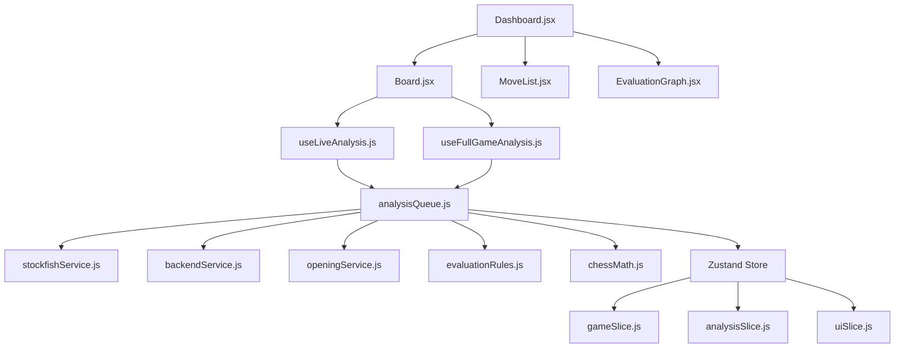

# ♟️ Frontend Architecture: Chess Analysis Board
> **Agent Guide** — Lee esto completo antes de modificar cualquier archivo. Es la fuente de verdad para forma del estado, contratos de servicios y decisiones de diseño críticas.

---

## ⚠️ Reglas Críticas Antes de Tocar Cualquier Cosa

1. **`evaluationRules.js` está DUPLICADO** — existe en frontend (`src/analysis/evaluationRules.js`) y backend. Cualquier cambio en clasificación de jugadas o cálculo de precisión **debe aplicarse en ambos simultáneamente**.
2. **`chessMath.js` también está DUPLICADO** — existe en ambos proyectos (`src/utils/chessMath.js`). Cambios en conversiones de CP a WP o Visual Score deben replicarse.
3. **Siempre llamar `AnalysisQueue.cancel()` antes de iniciar análisis** — es el patrón Mutex. Omitirlo inunda el engine con comandos concurrentes y corrompe la salida.
4. **Puzzle Mode deshabilita el análisis del engine** — no lo rehabilites en `Board.jsx` sin entender la lógica de prevención de spoilers.
5. **`buildSmartAnalysisOrder()` prioriza la vista actual** — no lo reemplaces con un loop secuencial o la UI perderá responsividad.
6. **Al salir de Explore Mode, el store se restaura desde `mainLineData`** — no limpies ese campo manualmente.

---

## 📊 Dependencias entre Módulos



**Radio de impacto:** Cambiar `analysisQueue.js` afecta tanto análisis en vivo como de partida completa. Cambiar `evaluationRules.js` afecta todos los labels visibles. Cambiar `stockfishService.js` solo afecta el camino WASM local.

---

## 🗃️ Zustand Store: Estado Inicial y Forma

### `gameSlice` — Estado Inicial
```typescript
{
  fen:              string,   // FEN de la posición inicial estándar
  history:          Array<VerboseMove>,  // ver schema abajo
  currentMoveIndex: -1,
  isExploreMode:    false,
  mainLineData:     null      // ver schema de Explore Mode abajo
}
```

#### Schema: `VerboseMove` (elementos de `history`)
Generado por `chess.history({ verbose: true })` de chess.js:
```typescript
{
  san:   string,  // Notación estándar (ej: "Nf3") — para visualización
  lan:   string,  // Notación larga UCI (ej: "g1f3") — para Stockfish
  from:  string,  // Casilla origen (ej: "g1")
  to:    string,  // Casilla destino (ej: "f3")
  piece: string,  // Tipo de pieza (ej: "n")
  color: string,  // "w" | "b"
  flags: string,  // Flags de chess.js ("n", "c", "e", "p", "k", "q")
  // ...otros campos de chess.js (promotion, captured, etc.)
}
```

#### Explore Mode: cambios en el store al activarse
Cuando `isExploreMode` pasa a `true`:
1. **`mainLineData`** almacena un snapshot completo del estado previo:
   ```typescript
   {
     history:          VerboseMove[],
     evaluationHistory: object,        // ver schema evaluationHistory
     bestMoves:         object,        // ver schema bestMoves — solo string UCI por ply
     moveEvaluations:   object,        // ver schema moveEvaluations
     alternativeLines:  object,        // ver schema alternativeLines — líneas multiPv
     branchIndex:       number         // currentMoveIndex en el momento de la divergencia
   }
   ```
2. **`history`** se trunca en `currentMoveIndex + 1` y se añade el movimiento exploratorio.
3. **`trimAnalysisState`** se ejecuta para limpiar evaluaciones posteriores al punto de divergencia.

Al salir de Explore Mode, el store se restaura completo desde `mainLineData`.

---

### `analysisSlice` — Estado Inicial
```typescript
{
  evaluation: { score: 0, mate: null },
  evaluationHistory: {},   // ver schema abajo
  moveEvaluations:   {},   // ver schema abajo
  bestMoves:         {},   // ver schema abajo
  alternativeLines:  {},   // ver schema abajo
  pgnCommentsByIndex: {},  // { [ply: number]: string } — comentarios de texto del PGN importado
  isAnalyzing:       false,
  engineConfig: {
    engineMode:   'local',              // 'local' (WASM) | 'remote' (Node.js)
    backendUrl:   'ws://localhost:9001',
    depth:        18,
    multiPv:      1,
    liveDepth:    16,   // depth usado en análisis en vivo (posición única)
    liveMultiPv:  3,    // multiPv usado en análisis en vivo
    threads:      2,
    hash:         32    // MB
  }
}
```

#### Schema: `evaluationHistory`
```typescript
{
  [ply: number]: {
    moveIndex: number,
    score:     number,        // Visual Score (−10 a 10), ya transformado desde CP
    mate:      number | null,
    bestMove:  string,        // formato LAN UCI (ej: "e2e4")
    lines:     Array<Line>    // ver schema de Line abajo
  }
}
```

#### Schema: `alternativeLines`
Líneas sugeridas por el engine cuando `multiPv > 1`. Se llena en `useLiveAnalysis.js` con resultados de búsqueda múltiple. Se guarda en `mainLineData` al entrar en Explore Mode.
```typescript
{
  [ply: number]: Array<{
    multipv: number,       // índice de la línea (1, 2, 3...)
    depth:   number,
    score:   number,       // Visual Score (−10 a 10) — YA transformado
    mate:    number | null,
    pv:      string,       // secuencia completa UCI (ej: "e2e4 e7e5 g1f3")
    move:    string        // primer movimiento UCI (ej: "e2e4")
  }>
}
```

#### Schema: `bestMoves`
Diccionario simple con el mejor movimiento por ply (multipv 1). Existe separado de `alternativeLines` para permitir renderizado rápido de flechas de sugerencia sin iterar arrays completos.
```typescript
{
  [ply: number]: string   // formato UCI (ej: "g1f3")
}
```

#### Schema: `moveEvaluations`
```typescript
{
  [ply: number]: "Brillante" | "Mejor" | "Excelente" | "Bueno" |
                 "Imprecisión" | "Error" | "Error grave" | "Libro"
}
```

#### Schema: `Line` (en `evaluationHistory`)
> ⚠️ En el frontend, `score` ya está transformado a Visual Score. En el backend y en mensajes WebSocket crudos, `score` está en centipeones.
```typescript
{
  multipv: number,
  depth:   number,
  score:   number,        // Visual Score (−10 a 10) — YA transformado
  mate:    number | null,
  pv:      string,        // variante en UCI (ej: "e2e4 e7e5 g1f3")
  move:    string         // primer movimiento en UCI (ej: "e2e4")
}
```

---

### `uiSlice` — Estado Inicial
```typescript
{
  appMode:         'analysis',   // 'analysis' | 'puzzle'
  boardOrientation: 'white',     // 'white' | 'black'
  clocks: {
    white: null,   // string con el tiempo o null
    black: null
  },
  // metadata de jugadores y partida cargada
}
```

---

## 🚀 Flujos de Análisis

### 1. Live Position (Posición Única)
```
useLiveAnalysis detecta cambio en fen o currentMoveIndex (Zustand)
  → AnalysisQueue.cancel()
  → AnalysisQueue.analyzeCurrentPosition(fen, moveIndex, engineConfig)
      │  usa liveDepth=16, liveMultiPv=3
      │
      ├── [Remote] backendService.analyzePosition()
      │     → WS "analyze_position" → Native Stockfish
      │     ← WS "position_progress" (streaming)
      │     ← WS "position_result"   (final)
      │
      └── [Local] stockfishService.analyzePosition()
            → Web Worker (Stockfish 18 WASM)
            ← "info score cp..." (parseado internamente)
            ← "bestmove"

  → mapLines(lines, isBlackTurn)   // CP → Visual Score
  → guardado en analysisSlice.evaluationHistory[moveIndex]
```

### 2. Full Game Analysis (Partida Completa)
```
Usuario hace clic en "Analizar Partida"
  → wantsFullAnalysis = true (Zustand)
  → useFullGameAnalysis hook dispara AnalysisQueue.analyzeGame()

  [Camino Local / WASM]
    → AnalysisQueue.cancel()
    → #buildPositions(history)        // genera array de FENs
    → #buildSmartAnalysisOrder(total, currentIndex)
        // orden: [currentIndex, currentIndex+1, currentIndex-1, ...resto 0..N]
        │
        ├── [Paralelo] OpeningService.detectOpenings(history)
        │     → TSV local (camino rápido)
        │     → [fallback] Lichess API
        │
        └── [Loop sobre posiciones priorizadas]
              → stockfishService.analyzePosition(fen, depth, multiPv)
              → ChessMath.cpToVisualScore(...) y cpToWhiteWinProb(...)
              → #tryClassifyMove(...)
                  └── espera resolución apertura si ply <= 30
              → guarda en analysisSlice
              → actualiza EvaluationGraph en tiempo real

    → EvaluationEngine.calculateAccuracy(all_results)
    → guarda accuracy en analysisSlice

  [Camino Remoto / Nativo]
    → backendService.analyzeGame(history, config)
    ← stream de mensajes "move_result" (uno por ply)
    ← mensaje "complete" con accuracy final
```

### 3. Carga de Partida (Punto de Entrada del Usuario)

`GameImport.jsx` tiene tres pestañas. Las dos primeras hacen fetch directo a APIs externas; el usuario nunca copia PGN manualmente salvo en la tercera.

```
[Pestaña Lichess]
  → Usuario escribe su nombre de usuario
  → fetch GET https://lichess.org/api/games/user/<username>
  → muestra lista de últimas partidas (resultado, fecha, rivales)
  → clic en partida → descarga PGN completo automáticamente → loadPgn()

[Pestaña Chess.com]
  → Usuario escribe su nombre de usuario
  → fetch GET https://api.chess.com/pub/player/<username>/games/...
  → muestra lista de últimas partidas
  → clic en partida → descarga PGN completo automáticamente → loadPgn()

[Pestaña PGN Manual]
  → Usuario pega PGN de cualquier fuente externa → loadPgn()

[gameSlice.loadPgn(pgnString)]
  → chess.js valida la sintaxis del PGN
  → extrae cabeceras: jugadores, ELO, FEN inicial (si existe)
  → extractPgnData.js procesa los comentarios del PGN:
      [%eval N]  → pre-carga evaluationHistory del store
                   (si el PGN ya viene analizado, el gráfico y labels
                    aparecen instantáneamente sin usar Stockfish)
      [%clk T]   → extrae el primer tiempo por color
                   → setea initialWhiteClock e initialBlackClock en UI
      comentarios de texto → guardados en pgnCommentsByIndex
                             (se muestran en MoveList)
  → genera history[] como array de VerboseMove
  → setea currentMoveIndex = 0  (o -1 para posición inicial)
  → limpia evaluationHistory, moveEvaluations, bestMoves, alternativeLines
    para evitar contaminación de datos de una partida anterior
```

> **Optimización clave:** Si el PGN importado incluye anotaciones `[%eval]` (como los de Lichess), el análisis completo queda pre-cargado. Stockfish solo es necesario si el usuario quiere mayor profundidad o si el PGN no tiene evaluaciones.

### 5. Ciclo de vida: mensaje `status`
```
backendService recibe { type: 'status', running: false }
  → callback onStatus del AnalysisQueue
  → analysisSlice.isAnalyzing = false
  → UI: desaparece el indicador visual de carga (punto parpadeante en EvaluationGraph)
  → La conexión WebSocket permanece abierta
```

---

## 🛡️ Patrón Mutex y Cancelación Asíncrona

Solo una tarea de análisis puede correr por vez. `AnalysisQueue.cancel(isUserAction)` garantiza la finalización limpia:

1. **`AbortController.abort()`** — interrumpe loops async internos en curso en el frontend.
2. **`stockfishService.stop()`** — envía `stop` al Web Worker WASM local.
3. **`backendService.cancel()`** — envía el mensaje `{"type":"cancel"}` al backend remoto.
4. **Estado UI (`isCanceling`)** — Si es una acción del usuario (`isUserAction = true`), la UI muestra "Cancelando..." e ignora nuevos clics hasta que el backend confirme.

### ACK de Cancelación (Evitando Race Conditions)
El frontend NO cierra el modal ni desactiva `isAnalyzing` inmediatamente al mandar el comando. En su lugar, existe un *listener global* en `AnalysisQueue` que espera el mensaje `{"type": "cancelled"}` del backend.
Solo cuando el backend confirma que el engine se ha detenido y los bucles han hecho `break` de forma segura, el frontend:
- Resetea `isCanceling = false`
- Setea `isAnalyzing = false`
- Oculta el modal de carga.

Esto evita que el frontend inicie un nuevo estado asíncrono mientras el backend todavía está cerrando promesas activas de Lichess o Stockfish.

---

## ⚙️ Configuración del Engine

| Contexto | Depth | MultiPV | Threads | Hash (MB) |
| :--- | :--- | :--- | :--- | :--- |
| Frontend WASM (full game) | 18 | 1 | 2 | 32 |
| Frontend WASM (live) | 16 | 3 | 2 | 32 |

`engineMode: 'local'` usa el Web Worker WASM. `engineMode: 'remote'` delega al backend Node.js.

---

## ⚠️ Manejo de Errores

### Fallo del Engine Local (WASM)
- `stockfishService` captura `worker.onerror`, destruye el worker y rechaza la promesa.
- `AnalysisQueue` captura el rechazo, setea `isAnalyzing = false`.
- `EvaluationGraph` muestra un placeholder.

### Fallo de Red (Backend Remoto)
- `backendService` emite un error o recibe `{ type: 'error' }`.
- `AnalysisQueue` lo maneja en su callback. Puede hacer fallback a modo Local si está configurado.

---

## 🧮 Fórmulas Matemáticas Clave

Definidas en `src/analysis/evaluationRules.js`. **No hardcodear en otros archivos. Mantener en sync con el backend.**

### CP → Win Probability
```
WP = 1 / (1 + e^(-0.00368208 * cp))
```

### CP → Visual Score
```
visualScore = cp / 100    // limitado al rango: [-10.0, 10.0], ajustado por turno de negras
```

### Umbrales de Clasificación

| Label | Condición |
| :--- | :--- |
| Brillante | Ganancia WP ≥ 0.05 AND es el mejor movimiento sugerido |
| Excelente | Pérdida WP ≤ 0.02 |
| Bueno | Pérdida WP ≤ 0.05 |
| Imprecisión | Pérdida WP ≤ 0.10 |
| Error | Pérdida WP ≤ 0.20 |
| Error grave | Pérdida WP > 0.20 |
| Libro | Movimiento dentro de la apertura conocida |

---

## 🧩 Modos de la App

### Analysis Mode (`appMode: 'analysis'`)
Suite completa para revisión de partidas. El engine corre automáticamente en cada cambio de FEN. Acceso a `EvaluationGraph`, `MoveList` con símbolos, y panel de configuración del engine.

### Puzzle Mode (`appMode: 'puzzle'`)
- Las interacciones en `Board.jsx` son interceptadas antes de ejecutar el movimiento.
- Los movimientos del usuario son validados contra `puzzleState.sequence`.
- **El análisis del engine está deshabilitado** — no se llama a `AnalysisQueue` para evitar spoilers.
- Feedback (sonidos/visuales) es inmediato tras cada movimiento.

---

## 🛠️ Utilidades: `chessMath.js` (DUPLICADO)

> ⚠️ Este archivo existe en frontend y backend. Cambios deben replicarse en ambos.

| Función | Descripción |
| :--- | :--- |
| `cpToWhiteWinProb(cp, mate, isBlackTurn)` | Convierte centipeones a probabilidad de victoria para blancas (WP). |
| `cpToVisualScore(cp, mate, isBlackTurn)` | Convierte centipeones a Visual Score (−10 a 10) ajustado por color. |

---

## 📂 Responsabilidades por Archivo

| Archivo | Rol | Efectos secundarios |
| :--- | :--- | :--- |
| `src/store/slices/gameSlice.js` | Lógica chess central, historial, Explore Mode | Fuente de verdad de la partida |
| `src/store/slices/analysisSlice.js` | Evaluaciones del engine, engineConfig | Actualizado por AnalysisQueue |
| `src/store/slices/uiSlice.js` | Modo de app, orientación, clocks, metadata | Solo UI, sin lógica de negocio |
| `src/services/analysisQueue.js` | **Orquestador.** Mutex, switching WASM/WS, loop de análisis | Escribe en analysisSlice |
| `src/services/stockfishService.js` | Bridge al Web Worker WASM, init de memoria, parsing UCI | Worker thread separado |
| `src/services/backendService.js` | Cliente WebSocket al backend Node.js | Conexión de red |
| `src/analysis/openingService.js` | Detección de aperturas (TSV local + fallback Lichess) | Llamadas de red en fallback |
| `src/analysis/evaluationRules.js` | ⚠️ DUPLICADO — umbrales matemáticos | **Debe mantenerse en sync con backend** |
| `src/utils/chessMath.js` | ⚠️ DUPLICADO — utilidades matemáticas (CP a WP, Score) | **Debe mantenerse en sync con backend** |
| `Board.jsx` | Área de interacción, orquesta hooks, intercepta en Puzzle Mode | Llama a cancel() en cada cambio de posición |
| `EvaluationGraph.jsx` | Visualizador SVG de tendencia y marcadores de errores | Solo lectura del store |
| `MoveList.jsx` | Historial de movimientos con símbolos y evaluaciones | Solo lectura del store |