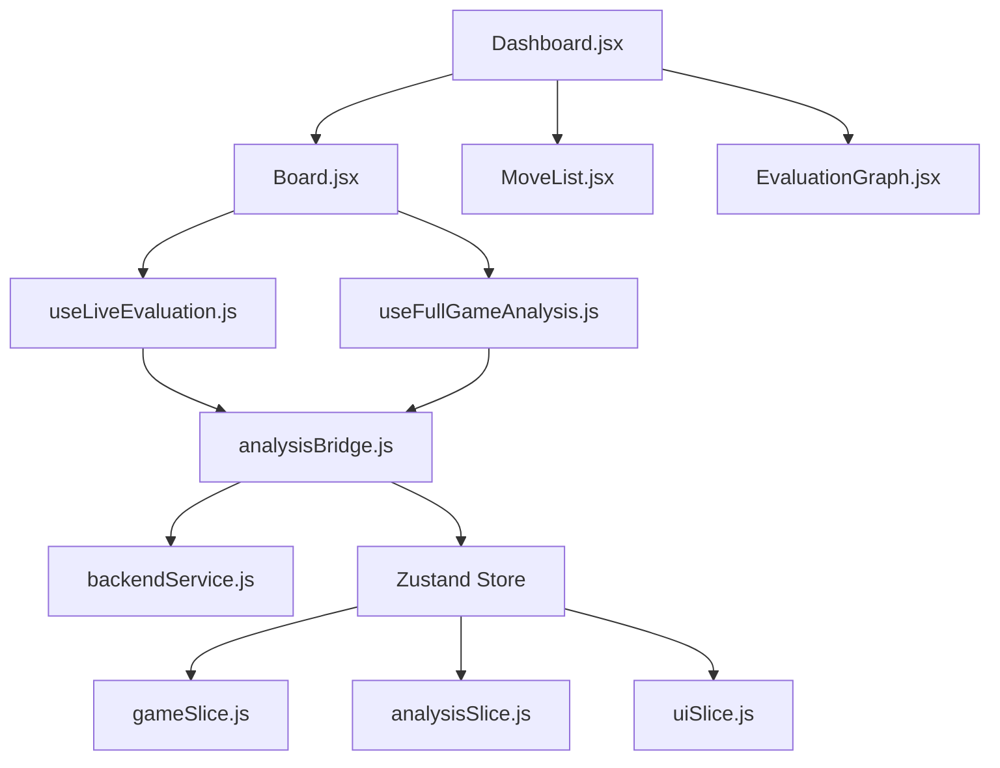

# ♟️ Frontend Architecture: Chess Analysis Board (Backend-Driven)
> **Agent Guide** — Esta es la fuente de verdad actualizada tras la migración total del análisis al backend nativo.

---

## ⚠️ Reglas Críticas

1. **El análisis es EXCLUSIVAMENTE remoto** — No existe lógica de Stockfish WASM ni reglas de clasificación en el frontend. Todo llega procesado vía WebSocket.
2. **`analysisBridge.js` es el punto de entrada único** — No uses `backendService.js` directamente para análisis; usa el bridge para manejar cancelaciones y callbacks.
3. **Mutex de Análisis** — Solo una tarea de análisis puede correr por vez. `analysisBridge.cancel()` debe llamarse antes de iniciar una nueva.
4. **Puzzle Mode** — Intercepta movimientos y deshabilita el análisis automático para evitar spoilers.

---

## 📊 Dependencias entre Módulos



**Radio de impacto:** Cambiar `analysisBridge.js` afecta a todos los flujos de análisis. Cambiar `backendService.js` afecta la comunicación WebSocket completa.

---

## 🗃️ Zustand Store: Estado de Análisis

### `analysisSlice` — Estado Clave
```typescript
{
  evaluation: { score: 0, mate: null },
  evaluationHistory: {},   // { [ply: number]: { score, mate, ... } }
  moveEvaluations:   {},   // { [ply: number]: "Brillante" | "Mejor" | "Error" ... }
  bestMoves:         {},   // { [ply: number]: "e2e4" (UCI) }
  alternativeLines:  {},   // { [ply: number]: Array<Line> }
  isAnalyzing:       false,
  accuracy:          null,
  engineConfig: {
    depth:        18,
    multiPv:      1,
    liveDepth:    16,
    liveMultiPv:  3
  }
}
```

---

## 🚀 Flujos de Análisis

### 1. Live Evaluation (Posición Actual)
1. `useLiveEvaluation` detecta cambio en FEN.
2. Llama a `analysisBridge.analyzePosition(fen, index)`.
3. `backendService` envía WS `analyze_position`.
4. El backend hace streaming de `position_progress` y finaliza con `position_result`.
5. El store actualiza `evaluation` y `alternativeLines`.

### 2. Full Game Analysis (Partida Completa)
1. Usuario inicia análisis.
2. `useFullGameAnalysis` llama a `analysisBridge.analyzeGame(history)`.
3. `backendService` envía WS `analyze_game`.
4. El backend procesa toda la partida y envía una ráfaga de mensajes `move_result` (uno por ply).
5. Cada `move_result` ya contiene el `label` (Brillante, Error, etc.) calculado por el backend.
6. Al finalizar, llega un mensaje `complete` con la precisión (accuracy) calculada.

---

## 🛡️ Patrón de Cancelación

El frontend implementa un patrón de cancelación reactivo:
1. El usuario cancela → `analysisBridge.cancel()` → WS `cancel`.
2. El backend detiene el motor y envía WS `cancelled`.
3. El frontend recibe `cancelled` y pone `isAnalyzing = false`.

Esto garantiza que no haya condiciones de carrera (race conditions) entre el motor deteniéndose y una nueva tarea iniciando.

---

## 🛠️ Servicios Disponibles

| Servicio | Responsabilidad |
| :--- | :--- |
| `analysisBridge.js` | Orquestador de alto nivel. Maneja hooks, cancelaciones y mapeo de callbacks al store. |
| `backendService.js` | Cliente WebSocket (ws://localhost:9001). Comunicación pura con el servidor Node.js. |
| `gameApi.js` | Cliente HTTP para Lichess y Chess.com (importación de partidas). |

---

## 📂 Responsabilidades por Archivo

| Archivo | Rol |
| :--- | :--- |
| `src/services/analysisBridge.js` | **Única fuente de verdad** para peticiones de análisis. |
| `src/services/backendService.js` | Gestión de conexión WebSocket y envío de mensajes crudos. |
| `src/hooks/useFullGameAnalysis.js` | Hook que reacciona a `isReviewRequested` para iniciar el análisis total. |
| `src/hooks/useLiveEvaluation.js` | Hook que pide análisis de la posición actual al mover piezas. |
| `src/utils/chessUtils.js` | Utilidades para PGN, iconos de piezas y cálculo de material (UI). |
| `src/utils/pgnExport.js` | Generación de PGN anotado usando los datos pre-calculados del store. |
| `Board.jsx` | Área de interacción, orquesta hooks, intercepta en Puzzle Mode |
| `EvaluationGraph.jsx` | Visualizador SVG de tendencia y marcadores de errores. Solo lectura del store. |
| `MoveList.jsx` | Historial de movimientos con símbolos y evaluaciones. Solo lectura del store. |