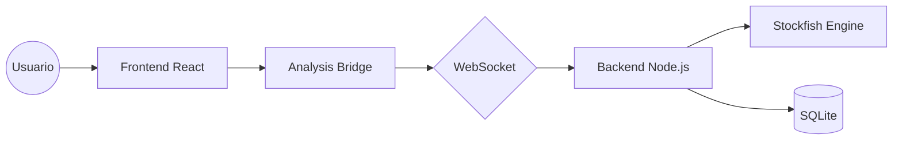

# ♟️ Tablero de Análisis de Ajedrez Pro

[](https://react.dev/)
[](https://vitejs.dev/)
[](https://nodejs.org/)
[](https://github.com/pmndrs/zustand)
[](https://stockfishchess.org/)
[](https://opensource.org/licenses/MIT)

Una plataforma de análisis de ajedrez de **alto rendimiento**, diseñada para ofrecer la potencia de un software de escritorio con la elegancia y accesibilidad de la web moderna. Optimizado para el análisis masivo de datos y la mejora técnica del jugador.

---


## ✨ Características de Vanguardia

- **🚀 Arquitectura Backend-Driven**: Procesamiento pesado delegada a un motor nativo vía WebSockets para un rendimiento sin precedentes, superando las limitaciones del navegador.
- **📊 Análisis de Precisión (Clasificación Chess.com Style)**: Algoritmo avanzado que categoriza cada movimiento:
  - 💎 **Brillante**: El único movimiento que mantiene o gana ventaja, a menudo difícil de encontrar.
  - 🌟 **Genial**: Movimientos excelentes que consolidan la posición.
  - ✅ **Mejor/Excelente**: Movimientos teóricos o sólidos.
  - ⚠️ **Inexactitud / Error / Blunder**: Identificación precisa basada en la pérdida de WinProb y evaluación absoluta.
- **🧩 Academia de Puzzles Dinámica**: Generación automática de problemas tácticos basados exclusivamente en **tus propios errores** detectados durante el análisis.
- **📈 Dashboard de Estadísticas "Big Data"**: Visualización de tendencias de rendimiento, precisión por apertura y detección de patrones de errores temporales (apuros de tiempo).
- **📥 Importación Universal e Inteligente**: Sincronización instantánea con **Lichess** y **Chess.com**. Soporte para carga masiva de archivos PGN y detección inteligente de color de jugador.
- **📝 Exportación de PGN Anotado**: Genera y descarga archivos PGN enriquecidos con comentarios del motor, evaluaciones de precisión y símbolos de jugadas (!!, ?, etc.).
- **📖 Explorador de Teoría Integrado**: Consulta la Master Database para comparar tus líneas con la teoría de Grandes Maestros en tiempo real.
- **🎨 Estética Premium y Flexible**: Interfaz moderna basada en *Glassmorphism*, animaciones fluidas con Framer Motion y un panel lateral ajustable para optimizar tu espacio de trabajo.

## 🛠️ Stack Tecnológico

| Capa | Tecnología | Rol Principal |
| :--- | :--- | :--- |
| **Frontend** | React 19 (Fiber) | Interfaz reactiva y renderizado de alta frecuencia. |
| **Estado** | Zustand 5 | Gestión de estado atómica y persistencia de análisis. |
| **Comunicación** | WebSockets (Socket.io) | Puente de baja latencia con el motor de análisis nativo. |
| **Motor** | Stockfish 18 | Motor de ajedrez líder mundial para evaluaciones precisas. |
| **Persistencia** | SQLite (Backend) | Almacenamiento eficiente de millones de jugadas analizadas. |
| **Visualización** | Framer Motion & CSS3 | Animaciones de UI y sistema de diseño dinámico. |
| **Lógica** | Chess.js v1.4 | Validación de movimientos y gestión de estado FEN/PGN. |

## 🚀 Instalación y Configuración

### 1. Requisitos Previos
- Node.js 20 o superior.
- [Backend de Análisis](https://github.com/HugoFucksmann/backendTablero) clonado y ejecutándose (necesario para el análisis remoto).

### 2. Clonar e Instalar
```bash
# Clonar el repositorio
git clone https://github.com/HugoFucksmann/tableroAnalisis.git
cd tableroAnalisis

# Instalar dependencias
npm install
```

### 3. Variables de Entorno
Crea un archivo `.env` en la raíz (opcional, para configuraciones personalizadas):
```env
VITE_BACKEND_URL=ws://localhost:9001
```

### 4. Iniciar Desarrollo
```bash
npm run dev
```

## 🏗️ Arquitectura del Sistema

El proyecto implementa un patrón de **Análisis Mutex** gestionado por un `analysisBridge`. Esto asegura que:
1. Solo una tarea de análisis (Live o Full Game) se ejecute a la vez.
2. Las peticiones de análisis sean cancelables de forma segura (prevención de condiciones de carrera).
3. El frontend permanezca ligero, actuando principalmente como un visualizador de los datos procesados en el backend.



## 🛡️ Rendimiento y Seguridad (COOP/COEP)

Para maximizar el rendimiento, la aplicación utiliza configuraciones de aislamiento de origen cruzado. Esto permite que el motor (si se usa en modo fallback WASM) aproveche múltiples hilos de CPU. 

Configuraciones incluidas para despliegue en:
- **Netlify**: `netlify.toml`
- **Vercel**: `vercel.json`

## 🛤️ Hoja de Ruta (Roadmap)

- [ ] Integración de análisis de profundidad variable (Iterative Deepening).
- [ ] Soporte para variantes de ajedrez (960, etc.).
- [ ] Modo Multijugador local con análisis post-partida automático.
- [ ] Exportación avanzada a PDF con diagramas de momentos críticos.

---

Diseñado y desarrollado con pasión por el ajedrez por **Hugo Fucksmann (ElColof)**. 
¿Tienes alguna sugerencia? ¡Los Pull Requests son bienvenidos! ♟️🔥
